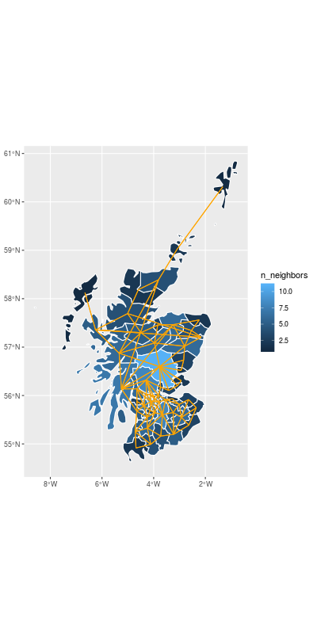

exclude: true

```{r setup, include=FALSE}
options(
  width = 80, 
  tibble.width = 80
)

knitr::opts_chunk$set(
  fig.align = "center",
  dpi = 200
)

library(dplyr)
library(ggplot2)
library(sf)

theme_set(theme_bw())
```

```{r get-data, include=FALSE}
lip_cancer = readRDS(here::here("data/lip_cancer.rds"))
```

---

## The data

.small[
```{r print-data}
lip_cancer
```
]

---
## Occurances

```{r plot-obs, echo=FALSE, out.width="100%", fig.height=4}
lip_cancer %>%
  select(Observed, Expected) %>%
  mutate(Observed/Expected) %>%
  tidyr::gather(var, value, -geometry) %>%
  ggplot(aes(fill = log(value))) +
    geom_sf(color="white", size=0.5) +
    facet_wrap(~forcats::as_factor(var))
```

---

## Neighbors

```{r neighbors, echo=FALSE, warning=FALSE}
d = readRDS(here::here("data/dist.rds"))
class(d) = NULL

W = (d == 0.0) * 1L
diag(W) = 0

m = rowSums(W)
lip_cancer$n_neighbors = m
```


```{r neigh_graph, eval=FALSE}
lc_sp = as(lip_cancer, 'Spatial')
lc_n_sf = lc_sp %>% 
  spdep::poly2nb() %>%
  spdep::nb2lines(coords = sp::coordinates(lc_sp)) %>%
  as("sf") %>%
  st_set_crs(st_crs(lip_cancer)) %>%
  st_geometry()
```


```{r neigh_plot, echo=FALSE, out.width = "66%"}

```
